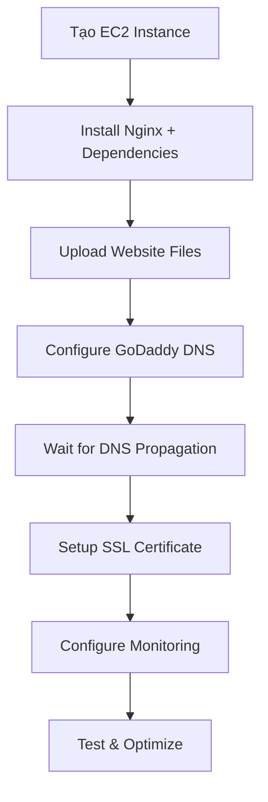

# ✅ TikTok Auto Scheduler - Deployment Checklist

## 🎯 **Tổng quan quy trình**



## 📋 **Chi tiết từng bước**

### ☁️ **1. AWS EC2 Setup**
- [ ] Tạo EC2 instance (Ubuntu 22.04, t2.micro)
- [ ] Cấu hình Security Group (ports 22, 80, 443)
- [ ] Tải xuống PEM key file
- [ ] Ghi nhớ Public IP address

### 🔧 **2. Server Configuration**
```bash
# Kết nối SSH
ssh -i "your-key.pem" ubuntu@YOUR_EC2_IP

# Chạy deployment script
bash deploy-script.sh
```

### 📁 **3. Upload Website Files**
```bash
# Từ máy local
bash upload-files.sh YOUR_EC2_IP YOUR_PEM_FILE_PATH
```

### 🌐 **4. GoDaddy DNS Configuration**
- [ ] Đăng nhập GoDaddy
- [ ] Vào DNS Management
- [ ] Thêm A records:
  - `@` → `YOUR_EC2_IP`
  - `www` → `YOUR_EC2_IP`
- [ ] Chờ DNS propagation (15-60 phút)

### 🔍 **5. Verify DNS**
```bash
# Kiểm tra DNS
nslookup your-domain.com
dig your-domain.com

# Online tools
https://www.whatsmydns.net/
```

### 🔒 **6. SSL Certificate Setup**
```bash
# Trên EC2 server
bash ssl-setup.sh
```

### 📊 **7. Monitoring & Optimization**
```bash
# Trên EC2 server  
bash monitoring-setup.sh
```

## 🧪 **Testing Checklist**

### ✅ **Functionality Tests**
- [ ] HTTP redirect to HTTPS
- [ ] Homepage loads correctly
- [ ] All navigation links work
- [ ] Mobile responsive design
- [ ] Privacy Policy page
- [ ] Terms of Service page
- [ ] Contact forms (if any)

### 🔒 **Security Tests**
- [ ] SSL certificate valid
- [ ] Security headers present
- [ ] No mixed content warnings
- [ ] Fail2ban running
- [ ] UFW firewall active

### ⚡ **Performance Tests**
```bash
# Speed test tools
https://gtmetrix.com/
https://pagespeed.web.dev/
https://www.webpagetest.org/
```

### 🌐 **Cross-browser Tests**
- [ ] Chrome
- [ ] Firefox  
- [ ] Safari
- [ ] Edge
- [ ] Mobile browsers

## 🚨 **Troubleshooting Guide**

### **DNS Issues**
```bash
# Clear local DNS cache
# Windows: ipconfig /flushdns
# Mac: sudo dscacheutil -flushcache
# Linux: sudo systemctl restart systemd-resolved
```

### **SSL Issues**
```bash
# Check certificate status
sudo certbot certificates

# Renew certificate manually
sudo certbot renew

# Check Nginx config
sudo nginx -t
```

### **Performance Issues**
```bash
# Check server resources
htop
df -h
free -h

# Check Nginx logs
sudo tail -f /var/log/nginx/error.log
sudo tail -f /var/log/nginx/access.log
```

## 📞 **Support Resources**

### **Documentation**
- AWS EC2: https://docs.aws.amazon.com/ec2/
- Nginx: https://nginx.org/en/docs/
- Let's Encrypt: https://letsencrypt.org/docs/
- GoDaddy DNS: https://www.godaddy.com/help/manage-dns-zone-files-680

### **Monitoring Commands**
```bash
# Server status
server-status.sh

# Manual backup
backup-website.sh

# Security status
sudo fail2ban-client status

# SSL check
sudo certbot certificates
```

## 🎉 **Final Verification**

### **Success Criteria**
- ✅ Website accessible via HTTPS
- ✅ SSL certificate A+ rating
- ✅ Page load time < 3 seconds
- ✅ Mobile responsive
- ✅ All security headers present
- ✅ Backup system running
- ✅ Monitoring active

### **Post-Deployment**
- [ ] Update DNS TTL to higher value (3600s)
- [ ] Setup CloudFlare (optional)
- [ ] Configure Google Analytics (optional)
- [ ] Setup uptime monitoring
- [ ] Document admin credentials

---

## 📈 **Performance Benchmarks**

| Metric | Target | Tool |
|--------|--------|------|
| Page Load Time | < 3s | GTmetrix |
| First Contentful Paint | < 1.5s | PageSpeed |
| Cumulative Layout Shift | < 0.1 | PageSpeed |
| SSL Rating | A+ | SSL Labs |
| Security Headers | A+ | Security Headers |

**🎯 Mục tiêu: Website TikTok Auto Scheduler hoạt động ổn định, bảo mật cao, và hiệu suất tối ưu!**
